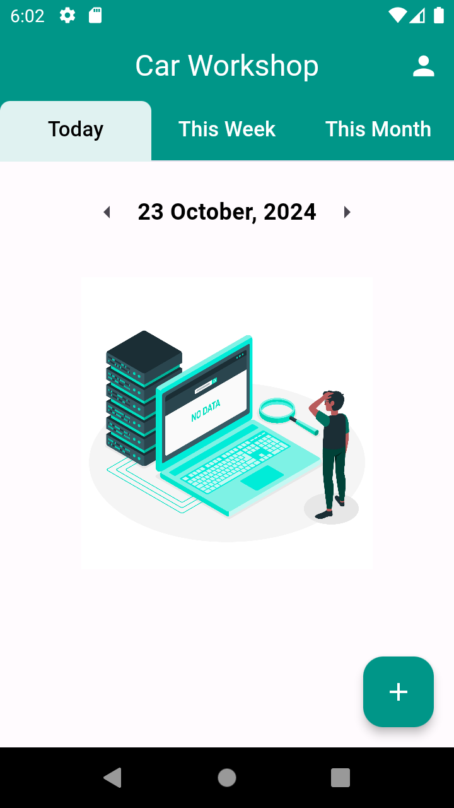

# Car Workshop Booking App

A Flutter app designed to simplify the process of booking car repairs and maintenance services. Users can easily schedule, view, and manage their bookings with mechanics, while the app provides an intuitive interface for both car Admins and mechanics.

## 🎥 Demo

Below are some screenshots showcasing the features of the app:

<table>
  <tr>
    <td></td>
    <td></td>
    <td></td>
  </tr>
  <tr>
    <td></td>
    <td></td>
    <td></td>
  </tr>
  <tr>
    <td></td>
    <td></td>
    <td></td>
  </tr>
</table>
<br/>

## 🚀 Features

- **User Authentication**: Secure login for users and mechanics.
- **Mechanic Search**: Find available mechanics for car repairs and maintenance.
- **Booking Management**: View and manage your bookings for car services.
- **Daily/Weekly/Monthly Views**: Convenient booking overview across different timeframes.
- **Booking Deletion**: Confirm booking deletions with a pop-up dialog.
- **Offline Caching**: Locally caches mechanic data for optimized performance.
- **User Role**: Admin is allowed to See all bookings, add new bookings and delete booking. Mechanic is allowed to only see bookings assigned to him/her

## 🏛️ Architecture/Design

- **Clean Architecture**: Ensures separation of concerns with distinct layers for presentation, domain, and data.
- **GetX for State Management**: Handles app state and dependencies effectively.

## 🛠️ Technologies Used

- **Flutter** 
- **Dart** 
- **GetX** (State management and dependency injection, local storage)
- **Firebase** (Authentication, Database, App Distribution)
- **Gradle** (Build automation)

## 🚧 Installation & Usage

1. Clone the repository:  
   ```bash
   git clone git@github.com:alxayeed/car_workshop.git
2. Navigate to the project directory
    ```
    cd car_workshop/
2. Install dependencies:
    ```
    flutter pub get
3. Run the project:
    ```
    flutter run
## 📱 Test the App on Your Phone (Firebase App Distribution)

To test the app on your phone using Firebase App Distribution, follow these steps:

1. Add your email for testing:

    - Open the android/app/build.gradle file.
    - Under the firebaseAppDistribution configuration, add your email:

        ```
        firebaseAppDistribution {
        releaseNotesFile="release-notes.txt"
        testers="your_email@example.com"
        }
2. Generate and Upload the release APK:

    - Navigate to the android directory:


        ```
        cd android
    - Run the Gradle command to build and upload the APK to Firebase App Distribution:
        ```
         ./gradlew assembleRelease appDistributionUploadRelease
3. Receive the Firebase App Distribution invitation:

    - After building and distributing the app, check your email inbox for an invitation from Firebase.
    - Accept the invitation to become a tester.
Install Firebase App Tester
    - Download and install the Firebase App Tester app on your phone.
    - After accepting the invitation and installing Firebase App Tester, you will be able to download and install the latest release of the Car Workshop Booking App directly on your phone.
